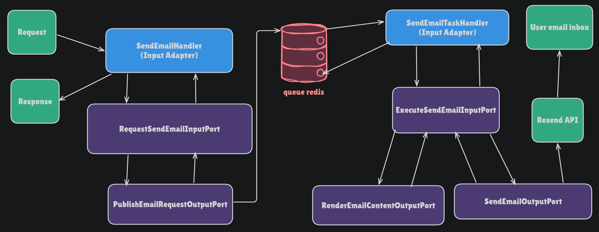
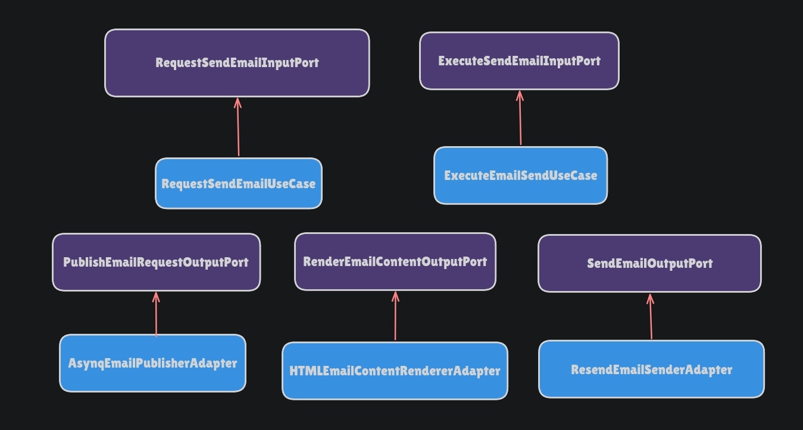

# Email Service

## Table of Contents

- [Overview](#overview)
- [Architecture and Flow](#architecture-and-flow)
  - [Application Model](#application-model)
  - [Port Implementations](#port-implementations)
- [Endpoints](#endpoints)
  - [Email Verification](#email-verification)
  - [Change Email](#change-email)
  - [Change Password](#change-password)
  - [Reset Password](#reset-password)
  - [Account Deletion](#account-deletion)
  - [Important Behavior](#important-behavior)
- [Configuration and Running the Service](#configuration-and-running-the-service)
  - [Environment Variables](#environment-variables)
  - [Required Dependencies](#required-dependencies)
  - [Running the Application](#running-the-application)
  - [Logs](#logs)
  - [Running Tests](#running-tests)
- [Current Limitations](#current-limitations)
  - [Delivery Status (Resend Webhooks)](#delivery-status-resend-webhooks)
  - [Logging](#logging)

## Overview

This service is responsible for handling transactional emails related to user
account management.
Its primary role is to deliver emails required for essential account operations,
such as email verification, password reset requests, and security notifications.

The service sends confirmation codes and notifications for user-related events,
including:

- Email verification
- Email address change
- Password change
- Password reset requests
- Account deletion confirmation

This service is intended to operate as part of a broader system architecture. It
will be integrated  with other backend services responsible for user management,
particularly an authentication service  that handles account lifecycle operations.

Previously, this functionality existed within a monolithic backend built with
Django REST, where both authentication  logic and email delivery were handled
within the same application. In this implementation, the email functionality has
been extracted into a dedicated service written in Go, focusing exclusively on
transactional email delivery.

Although the service is fully operational, additional improvements and features
are planned for future iterations.

## Architecture and flow

The architecture used follows the Hexagonal pattern (Ports and Adapters), aiming
to improve maintainability, extensibility, and testability.

The flow is organized as follows:



The email delivery process is executed in two stages: request creation and
asynchronous processing.

1. A client service sends an HTTP request to the Email Service.
2. The request is handled by `SendEmailHandler`, which acts as an input adapter.
This component validates the request and forwards it to the application layer
through the `RequestSendEmailInputPort`.
3. The `RequestSendEmailInputPort` processes the request and publishes a job to
the background queue using the `PublishEmailRequestOutputPort`.
4. Once the job is successfully published, the API returns a response indicating
that the request has been queued.

At this stage, the service does not confirm whether the email was sent
successfully. The response only indicates that the email request was accepted
and scheduled for asynchronous processing.

1. The job is stored in the Redis queue and later consumed by a worker.
2. The worker executes `SendEmailTaskHandler`, another input adapter responsible
for processing queued email jobs.
3. The worker triggers the `ExecuteSendEmailInputPort`, which is implemented by
the `ExecuteEmailSendUseCase`.
4. The use case orchestrates the email delivery process by:
    - rendering the email content using `RenderEmailContentOutputPort`
    - sending the email using `SendEmailOutputPort`
5. The email content is generated from HTML templates, and the final message is
delivered through the configured email provider (`Resend API`).
6. The user receives the email in their inbox.

This approach allows the API to respond quickly while delegating the email
delivery process to background workers.

### Application Model

This service does not introduce a separate domain layer. The current scope of
the system does not require complex domain rules, and introducing an additional
domain abstraction would add unnecessary complexity.

Instead, the application logic is concentrated in the application layer.

The `emailmessage` package defines the structures that represent the different
types of email messages. These structures also include the basic validations
required to ensure that all necessary data is present before the request is processed.

These structures act as application-level models used during the email
processing workflow.

### Port Implementations

The ports shown in the architecture diagram represent application abstractions.
These interfaces define the capabilities required by the use cases without
binding the application to specific implementations.

Concrete implementations of these ports are provided by the adapters layer and
use cases:



This structure allows external integrations to be replaced without modifying the
application logic.

## Endpoints

All endpoints follow the same behavior pattern. The API receives a request
describing an email operation and enqueues the email delivery task for
asynchronous processing.

The service does **not confirm whether the email was successfully delivered**.
A successful response only indicates that the request was accepted and placed
in the processing queue.

All endpoints return JSON responses and share the same response semantics.

### Common Response Codes

#### **202 Accepted**

Returned when the request is successfully validated and the email task is queued
for asynchronous processing.

```json
{
  "status": "accepted"
}
```

#### **400 Bad Request**

Returned when the request body contains malformed JSON or violates the JSON
parsing rules (invalid syntax, unknown fields, empty body, wrong types, etc.).

Example:

```json
{
  "error": "body contains unknown key \"example\""
}
```

#### **422 Unprocessable Entity**

Returned when the JSON payload is syntactically valid but fails field validation
during email message construction.

Example:

```json
{
  "error": "verification_code field is required",
  "field": "name field"
}
```

#### **500 Internal Server Error**

Returned when an unexpected internal failure occurs.

Example:

```json
{
  "error": "internal server error"
}
```

---

### Email Verification

#### Send Email Verification Code

```bash
POST /api/v1/email/verification/code
```

Sends an email verification code.

Request body:

```json
{
  "to": "user@example.com",
  "subject": "Verify your email",
  "verification_code": "123456",
  "code_expiration_time": "2 minutes | hours | days",
  "email_verification_link": "https://example.com/verify",
  "email_verification_deadline_days": "7"
}
```

---

#### Notify Email Verification

```bash
POST /api/v1/email/verification/notify
```

Sends a notification confirming that the email has been successfully verified.

Request body:

```json
{
  "to": "user@example.com",
  "subject": "Email verified",
  "login_link": "https://example.com/login"
}
```

---

### Change Email

#### Send Change Email Code

```bash
POST /api/v1/email/change-email/code
```

Sends a verification code to confirm an email address change.

Request body:

```json
{
  "to": "user@example.com",
  "subject": "Confirm email change",
  "verification_code": "123456",
  "code_expiration_time": "2 minutes | hours | days",
}
```

---

#### Notify Change Email

```bash
POST /api/v1/email/change-email/notify
```

Sends a notification informing the user that their email address has been changed.

Request body:

```json
{
  "to": "user@example.com",
  "subject": "Email changed",
  "login_link": "https://example.com/login"
}
```

---

### Change Password

#### Send Change Password Code

```bash
POST /api/v1/email/change-password/code
```

Sends a verification code to confirm a password change.

Request body:

```json
{
  "to": "user@example.com",
  "subject": "Confirm password change",
  "verification_code": "123456",
  "code_expiration_time": "2 minutes | hours | days"
}
```

---

#### Notify Change Password

```bash
POST /api/v1/email/change-password/notify
```

Sends a notification informing the user that their password has been changed.

Request body:

```json
{
  "to": "user@example.com",
  "subject": "Password changed",
  "login_link": "https://example.com/login"
}
```

---

### Reset Password

#### Send Reset Password Code

```bash
POST /api/v1/email/reset-password/code
```

Sends a password reset verification code.

Request body:

```json
{
  "to": "user@example.com",
  "subject": "Reset your password",
  "verification_code": "123456",
  "code_expiration_time": "2 minutes | hours | days",
  "reset_password_link": "https://example.com/reset-password"
}
```

---

#### Notify Reset Password

```bash
POST /api/v1/email/reset-password/notify
```

Sends a notification informing the user that their password has been reset.

Request body:

```json
{
  "to": "user@example.com",
  "subject": "Password reset successful",
  "login_link": "https://example.com/login"
}
```

---

### Account Deletion

#### Send Deletion Code

```bash
POST /api/v1/email/deletion/code
```

Sends a verification code to confirm account deletion.

Request body:

```json
{
  "to": "user@example.com",
  "subject": "Confirm account deletion",
  "verification_code": "123456",
  "code_expiration_time": "2 minutes | hours | days"
}
```

---

#### Notify Deletion

```bash
POST /api/v1/email/deletion/notify
```

Sends a notification confirming that the user account has been deleted.

Request body:

```json
{
  "to": "user@example.com",
  "subject": "Account deleted"
}
```

---

### Important Behavior

All endpoints behave the same way internally:

1. The request payload is validated.
2. The email message is constructed.
3. The request is sent to the application use case.
4. The email delivery task is published to a background queue.
5. The API returns **202 Accepted** immediately.

The actual email delivery is handled asynchronously by a worker process.

## Configuration and Running the Service

This service requires a small set of environment variables and external
dependencies in order to run correctly. The configuration is provided through
environment variables, which define credentials, default email settings, and the
address of the message broker responsible for background job processing.

### Environment Variables

The following variables must be configured before running the service:

```bash
RESEND_API_KEY
```

API key used to authenticate requests with the email service provider. This key
is provided by the email platform and must be kept secret. It should never be
committed to version control.

---

```bash
FROM_EMAIL
```

Default sender name and email address used for outgoing emails. In development environments
this can use the default domain provided by the email service, but in production
it should use a verified domain such as `no-reply@yourdomain.com`.

#### Resend Sandbox Mode

When using **Resend** without a verified domain, the account operates in
**sandbox mode**.

In this mode there are two important restrictions.

First, the **recipient (`To`) must be the same email address used in the Resend
account**. Attempts to send emails to other addresses will be rejected by the API.

Second, the **sender (`From`) must use the default testing address provided by
Resend**, typically:

`Dev <onboarding@resend.dev>`

For this reason, during local development the service is configured with:

```bash
FROM_EMAIL="Dev <onboarding@resend.dev>"
```

This allows testing the integration, templates, and email workflow without
configuring a domain.

#### Using a Verified Domain

After verifying a domain in the Resend dashboard, these restrictions are removed.

The `From` address must then use an email belonging to the verified domain,
for example:

MyApp <noreply@mydomain.com>

Once a domain is verified, emails can be sent to **any recipient address**, and
the service operates as a normal email delivery system.

---

```bash
BROKER_ADDR
```

Address of the message broker responsible for background job processing.

The format is `host:port`.

When running the application locally outside Docker, use:

```bash
BROKER_ADDR=localhost:6379
```

When running inside Docker Compose, **do not use localhost**. Inside containers,
`localhost` refers to the container itself. Instead, the service name defined in
`docker-compose.yml` must be used.

Example:

```bash
BROKER_ADDR=redis:6379
```

In production environments, the Redis instance should be secured and not
publicly exposed.

### Required Dependencies

The service depends on the following tools:

- Docker
- Docker Compose
- A Resend account for email delivery

Docker installation instructions can be found at:

- [Docker Installation](https://docs.docker.com/get-docker/)

A Resend account can be created at:

- [Resend](https://resend.com/)

### Running the Application

The repository includes a `Makefile` that simplifies common development tasks
such as starting containers, rebuilding services, viewing logs, and running tests.

To start the containers:

```bash
make up
```

To rebuild and start containers:

```bash
make build
```

To start or stop existing containers:

```bash
make start
make stop
```

To list containers:

```bash
make list
```

### Logs

Logs can be collected or streamed directly from the containers using the
provided commands. These commands allow exporting logs to files, retrieving
recent logs, or following logs in real time.

Examples include retrieving logs for the email service, the Redis broker, or
all services, either as static files or live streams.

### Running Tests

The project includes multiple test modes. To date, it includes 193 tests + subtests.

Default tests (unit tests and local integrations):

```bash
go test ./...
```

Integration tests using Testcontainers:

```bash
go test -tags=lazy ./...
```

Email integration tests that call the Resend API (requires valid credentials):

```bash
go test -tags=email ./...
```

To run all tests:

```bash
go test -tags=email,lazy ./...
```

The Makefile provides shortcuts for these commands to simplify execution during
development.

## Current Limitations

### Delivery Status (Resend Webhooks)

This service sends emails using **Resend**. When a request to send an email is
made, the provider only confirms that the message was accepted for processing.
The response does not indicate whether the email was ultimately delivered to
the recipient.

Final delivery events such as `delivered`, `bounced`, `complained`, or
`suppressed` are generated asynchronously by the provider. These events are
exposed through webhooks, which require a publicly accessible HTTP endpoint
capable of receiving callbacks from the provider.

In a Hexagonal Architecture, this would be implemented as an additional input
adapter responsible for receiving webhook requests and translating them into
commands or events processed by the application core.

This project does not implement webhook handling because the service currently
runs only in a local development environment and does not expose any public
endpoint that could receive webhook callbacks. As a result, the system can
confirm that an email request was accepted by the provider, but it cannot
automatically determine the final delivery status of the message.

During development, the delivery status can still be inspected through the
**Resend dashboard**, which provides visibility into message delivery events.

### Logging

The application generates logs at the HTTP layer, background worker, and
external service adapters. These logs provide visibility into request handling,
job execution, and interactions with external services.

Logs are written to container output and can be inspected using Docker logs or
exported to files using commands available in the `Makefile`.

This approach has some limitations. Logs are ephemeral because they are not
stored in a centralized logging system, meaning they may be lost if containers
are removed or recreated. In addition, there is no log aggregation or indexing
system in place, which would normally be used in production environments for
persistent storage, querying, and cross-service correlation.

For the scope of this project, the current logging approach is sufficient for
development and debugging, while a production system would typically integrate
with a centralized logging platform.
