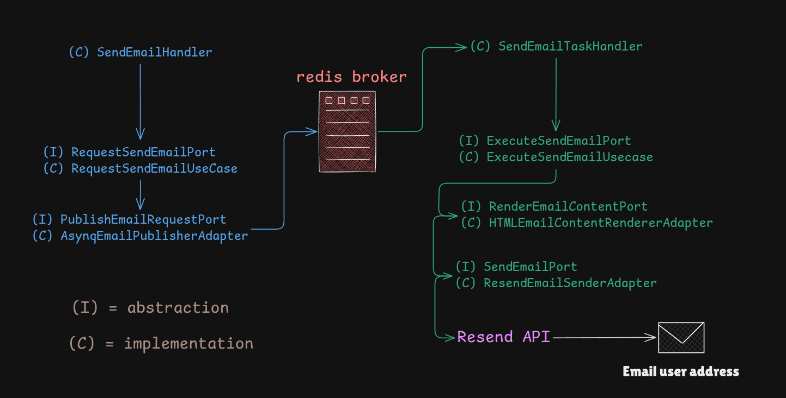

# Email Service

## Table of Contents

- [Overview](#overview)
- [Technologies](#technologies)
- [Architecture and Flow](#architecture-and-flow)
  - [Domain Layer](#domain-layer)
  - [Message Object](#message-object)
- [Endpoints](#endpoints)
  - [Verification Code Emails](#verification-code-emails)
  - [Notification Emails](#notification-emails)
  - [Important Behavior](#important-behavior)
- [Responses](#responses)
  - [202 Accepted](#202-accepted)
  - [400 Bad Request](#400-bad-request)
  - [422 Unprocessable Entity](#422-unprocessable-entity)
  - [500 Internal Server Error](#500-internal-server-error)
- [Configuration and Running the Service](#configuration-and-running-the-service)
  - [Environment Variables](#environment-variables)
  - [Required Dependencies](#required-dependencies)
  - [Running the Application](#running-the-application)
  - [Send a Request](#send-a-request)
  - [Logs](#logs)
  - [Running Tests](#running-tests)
- [Current Limitations](#current-limitations)
  - [Delivery Status (Resend Webhooks)](#delivery-status-resend-webhooks)
  - [Logging](#logging)

## Overview

This service is responsible for handling transactional email requests related to
user account management.

Its primary role is to validate incoming requests, construct email messages, and
enqueue email delivery jobs for asynchronous processing. The actual email
delivery is performed by a background worker, which consumes queued jobs and
uses the Resend API to send emails.

The service supports transactional emails required for essential account
operations, including:

- Email verification
- Email address change
- Password change
- Password reset requests
- Account deletion confirmation

This service is intended to operate as part of a broader system architecture. It
integrates with other backend services responsible for user management,
particularly an authentication service that handles account lifecycle
operations.

Previously, this functionality existed within a monolithic backend built with
Django REST, where authentication logic and email handling were implemented
within the same application. In this implementation, the email functionality has
been extracted into a dedicated Go service responsible for validating requests,
building email messages, and coordinating asynchronous email delivery.

Although the service is fully operational, additional improvements and features
are planned for future iterations.

## Technologies

This service is built using the following technologies and libraries:

- **Go** — Programming language used to implement the service.
- **Asynq** — Task queue library for asynchronous job processing backed by Redis.
- **Redis** — Message broker used by Asynq to store and distribute background jobs.
- **Resend** — Email delivery provider responsible for sending transactional emails.
- **Testify** — Testing toolkit providing assertions, mocks, and testing utilities.
- **Testcontainers Go** — Library for running integration tests using Docker containers.
- **Godotenv** — Library for loading environment variables from `.env` files
  during development.

## Architecture and flow

The architecture used follows the Hexagonal pattern (Ports and Adapters), aiming
to improve maintainability, extensibility, and testability.

The flow is organized as follows:



The email delivery process is executed in two stages: request creation and
asynchronous processing.

1. A client service sends an HTTP request to the Email Service.
2. The request is handled by `SendEmailHandler` (input adapter), which acts as
an input adapter.
This component validates the request and forwards it to the application layer
through the `RequestSendEmailPort` (input port).
3. The `RequestSendEmailPort` processes the request and publishes a job to
the background queue using the `PublishEmailRequestPort` (output port).
4. Once the job is successfully published, the API returns a response indicating
that the request has been queued.

At this stage, the service does not confirm whether the email was sent
successfully. The response only indicates that the email request was accepted
and scheduled for asynchronous processing.

1. The job is stored in the Redis queue and later consumed by a worker.
2. The worker executes `SendEmailTaskHandler` (input adapter), another input
adapter responsible for processing queued email jobs.
3. The worker triggers the `ExecuteSendEmailPort` (input port)
4. The use case orchestrates the email delivery process by:
    - rendering the email content using `RenderEmailContentPort` (output port).
    - sending the email using `SendEmailOutputPort` (output port).
5. The email content is generated from HTML templates, and the final message is
delivered through the configured email provider (`Resend API`).
6. The user receives the email in their inbox.

This approach allows the API to respond quickly while delegating the email
delivery process to background workers.

### Domain layer

This service does not introduce a separate domain layer. The current scope of
the system does not require complex domain rules, and introducing an additional
domain abstraction would add unnecessary complexity.

Instead, the application logic is concentrated in the application layer.

The `message` package defines the structures that represent the different
types of email messages. These structures also include the basic validations
required to ensure that all necessary data is present before the request is processed.

These structures act as application-level models used during the email
processing workflow.

### Message Object

The `Message` object is the central data structure of the application. It
represents a transactional email request and carries all the information
required to process an email throughout its lifecycle.

Every request accepted by the API is validated and converted into a `Message`
instance. This object is then enqueued and later consumed by a background worker,
which renders the appropriate email template and sends the email using the
Resend API.

The name **Message** was intentionally chosen because the object represents the
message exchanged between the API and the asynchronous processing pipeline,
rather than the email itself. In other words, it is the unit of work that flows
through the queue until it is processed by a worker.

The object contains the following fields:

| Field | Description |
| ------- | ------------- |
| `id` | Unique identifier used for tracing, auditing, and idempotency. |
| `type` | Identifies the email workflow or template to be processed. |
| `to` | Recipient email address. |
| `variables` | Dynamic values used to populate the selected email template. |

Example:

```json
{
  "id": "bc3a8e9b-0b5c-4384-9136-1e96a4a6cb1b",
  "type": "email_verification_code",
  "to": "user@example.com",
  "variables": {
    "verification_code": "123456"
  }
}
```

## Endpoints

The API exposes a single endpoint for all email operations.

```http
POST /api/v1/email
```

The request body determines which email will be sent through the `type` field.

The API receives the request, validates it, constructs the email message, and
enqueues the email delivery task for asynchronous processing.

### Verification Code Emails

Message types that end with `_code` require the `variables.verification_code`
field.

```json
{
  "id": "bc3a8e9b-0b5c-4384-9136-1e96a4a6cb1b",
  "type": "email_verification_code",
  "to": "user@example.com",
  "variables": {
    "verification_code": "123456"
  }
}
```

Supported message types:

- `email_verification_code`
- `change_email_code`
- `change_password_code`
- `reset_password_code`
- `account_deletion_code`

#### Important Notes

Types whose names end with `_code` must include the following structure:

```json
{
  "variables": {
    "verification_code": "123456"
  }
}
```

Omitting the `verification_code` field or providing an invalid value will result
in a `422 Unprocessable Entity` response.

### Notification Emails

Notification message types do not require the `variables` field.

```json
{
  "id": "bc3a8e9b-0b5c-4384-9136-1e96a4a6cb1b",
  "type": "notify_email_verified",
  "to": "user@example.com"
}
```

Supported message types:

- `notify_email_verified`
- `notify_email_changed`
- `notify_password_changed`
- `notify_password_reset`
- `notify_account_deleted`

---

### Important Behavior

All endpoints behave the same way internally:

1. The request payload is validated.
2. The email message is constructed.
3. The request is sent to the application use case.
4. The email delivery task is published to a background queue.
5. The API returns **202 Accepted** immediately.

The actual email delivery is handled asynchronously by a worker process.

The service does **not confirm whether the email was successfully delivered**.
A successful response only indicates that the request was accepted and placed
in the processing queue.

---

## Responses

### **202 Accepted**

Returned when the request is successfully validated and the email task is queued
for asynchronous processing.

```json
{
  "status": "accepted"
}
```

### **400 Bad Request**

Returned when the request body contains malformed JSON or violates the JSON
parsing rules (invalid syntax, unknown fields, empty body, wrong types, etc.).

Example:

```json
{
  "error": "body contains unknown key \"example\""
}
```

### **422 Unprocessable Entity**

Returned when the request body is syntactically valid JSON but contains invalid
or missing data, preventing the request from being processed.

This status may be returned when:

-A required field is missing.
-An email field contains an invalid email format.
-The provided message type is invalid.
-The verification code is missing, null, or invalid for the selected message type.

Example:

```json
{
  "error": "verification_code field is required",
  "field": "verification_code"
}
```

Types whose names end with code (verification code message types) must include
the following variables structure in the request body:

```json
{
  "variables": {
    "verification_code": "123456"
  }
}
```

The verification_code field is required for these message types. Omitting it
or providing an invalid value will result in a 422 Unprocessable Entity response.

### **500 Internal Server Error**

Returned when an unexpected internal failure occurs.

Example:

```json
{
  "error": "internal server error"
}
```

---

## Configuration and Running the Service

This service requires a small set of environment variables and external
dependencies in order to run correctly. The configuration is provided through
environment variables, which define credentials, default email settings, and the
address of the message broker responsible for background job processing.

### Environment Variables

The following variables must be configured before running the service:

```bash
RESEND_API_KEY
```

API key used to authenticate requests with the email service provider. This key
is provided by the email platform and must be kept secret. It should never be
committed to version control.

---

```bash
FROM_EMAIL
```

Default sender name and email address used for outgoing emails. In development environments
this can use the default domain provided by the email service, but in production
it should use a verified domain such as `no-reply@yourdomain.com`.

#### Resend Sandbox Mode

When using **Resend** without a verified domain, the account operates in
**sandbox mode**.

In this mode there are two important restrictions.

First, the **recipient (`To`) must be the same email address used in the Resend
account**. Attempts to send emails to other addresses will be rejected by the API.

Second, the **sender (`From`) must use the default testing address provided by
Resend**, typically:

`Dev <onboarding@resend.dev>`

For this reason, during local development the service is configured with:

```bash
FROM_EMAIL="Dev <onboarding@resend.dev>"
```

This allows testing the integration, templates, and email workflow without
configuring a domain.

#### Using a Verified Domain

After verifying a domain in the Resend dashboard, these restrictions are removed.

The `From` address must then use an email belonging to the verified domain,
for example:

MyApp <noreply@mydomain.com>

Once a domain is verified, emails can be sent to **any recipient address**, and
the service operates as a normal email delivery system.

---

```bash
BROKER_ADDR
```

Address of the message broker responsible for background job processing.

The format is `host:port`.

When running the application locally outside Docker, use:

```bash
BROKER_ADDR=localhost:6379
```

When running inside Docker Compose, **do not use localhost**. Inside containers,
`localhost` refers to the container itself. Instead, the service name defined in
`docker-compose.yml` must be used.

Example:

```bash
BROKER_ADDR=redis:6379
```

In production environments, the Redis instance should be secured and not
publicly exposed.

### Required Dependencies

The service depends on the following tools:

- Docker
- Docker Compose
- A Resend account for email delivery

Docker installation instructions can be found at:

- [Docker Installation](https://docs.docker.com/get-docker/)

A Resend account can be created at:

- [Resend](https://resend.com/)

### Running the Application

The repository includes a `Makefile` that simplifies common development tasks
such as starting containers, rebuilding services, viewing logs, and running tests.

To start the containers:

```bash
make up
```

To rebuild and start containers:

```bash
make build
```

To start or stop existing containers:

```bash
make start
make stop
```

To list containers:

```bash
make list
```

### Send a Request

You can test the API using `curl`:

```bash
curl -X POST http://localhost:8080/api/v1/email \
  -H "Content-Type: application/json" \
  -d '{
    "id": "bc3a8e9b-0b5c-4384-9136-1e96a4a6cb1b",
    "type": "email_verification_code",
    "to": "user@example.com",
    "variables": {
      "verification_code": "123456"
    }
  }'
```

### Logs

Logs can be collected or streamed directly from the containers using the
provided commands in `Makefile`. These commands allow exporting logs to files, retrieving
recent logs, or following logs in real time.

Examples include retrieving logs for the email service, the Redis broker, or
all services, either as static files or live streams.

### Running Tests

The project includes multiple test modes.
The Makefile provides shortcuts for these commands to simplify execution during
development.

Default tests (unit tests and local integrations):

```bash
go test ./...
```

```bash
make test
```

Integration tests using Testcontainers:

```bash
go test -tags=slow ./...
```

```bash
make testslow
```

Email integration tests that call the Resend API (requires valid credentials):

```bash
go test -tags=email ./...
```

```bash
make testemail
```

To run all tests:

```bash
go test -tags=email,slow ./...
```

```bash
make testall
```

## Current Limitations

### Delivery Status (Resend Webhooks)

This service sends emails using **Resend**. When a request to send an email is
made, the provider only confirms that the message was accepted for processing.
The response does not indicate whether the email was ultimately delivered to
the recipient.

Final delivery events such as `delivered`, `bounced`, `complained`, or
`suppressed` are generated asynchronously by the provider. These events are
exposed through webhooks, which require a publicly accessible HTTP endpoint
capable of receiving callbacks from the provider.

In a Hexagonal Architecture, this would be implemented as an additional input
adapter responsible for receiving webhook requests and translating them into
commands or events processed by the application core.

This project does not implement webhook handling because the service currently
runs only in a local development environment and does not expose any public
endpoint that could receive webhook callbacks. As a result, the system can
confirm that an email request was accepted by the provider, but it cannot
automatically determine the final delivery status of the message.

During development, the delivery status can still be inspected through the
**Resend dashboard**, which provides visibility into message delivery events.

### Logging

The application generates logs at the HTTP layer, background worker, and
external service adapters. These logs provide visibility into request handling,
job execution, and interactions with external services.

Logs are written to container output and can be inspected using Docker logs or
exported to files using commands available in the `Makefile`.

This approach has some limitations. Logs are ephemeral because they are not
stored in a centralized logging system, meaning they may be lost if containers
are removed or recreated. In addition, there is no log aggregation or indexing
system in place, which would normally be used in production environments for
persistent storage, querying, and cross-service correlation.

For the scope of this project, the current logging approach is sufficient for
development and debugging, while a production system would typically integrate
with a centralized logging platform.
